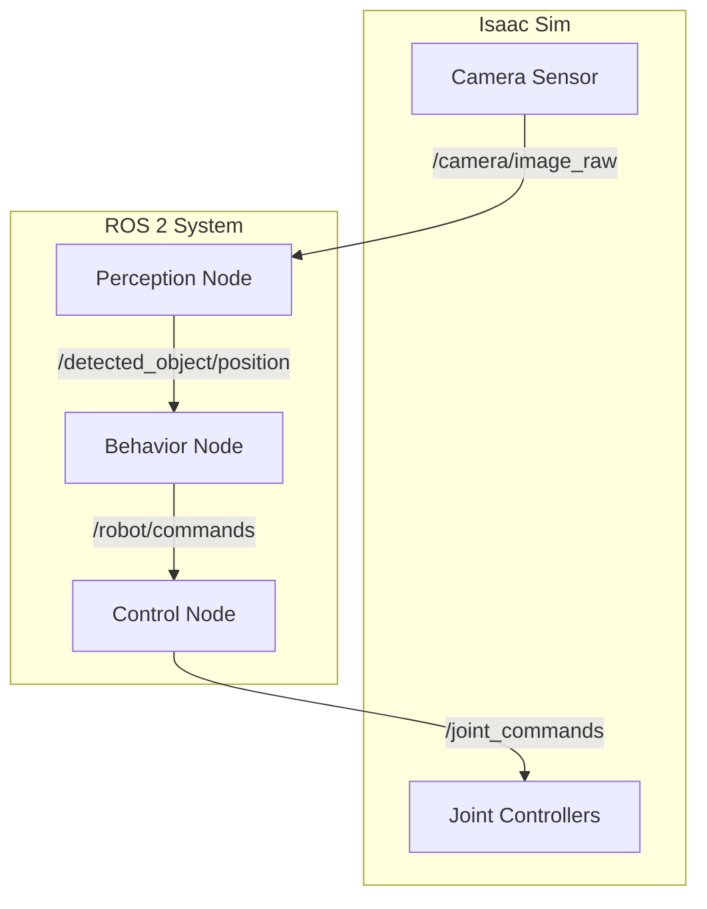

# Capstone: The Autonomous Humanoid Project

Welcome to the culmination of your learning journey. The capstone project is where you will integrate everything you've learned—from ROS 2 fundamentals to advanced simulation and perception—to build a complete, autonomous robotic system.

## 1. Project Goal

The goal of the capstone project is to build an autonomous humanoid robot in simulation that can **find a specific object in a room, navigate to it, pick it up, and place it in a designated location.**

This project will test your ability to think like a robotics engineer, breaking down a complex task into manageable sub-systems and then integrating them to create emergent intelligent behavior.

## 2. The Robot & Environment

-   **Robot**: We will use a pre-existing, advanced humanoid robot model in **NVIDIA Isaac Sim**, such as the Unitree H1 or Boston Dynamics Atlas. This model will come with a URDF (Unified Robot Description Format) file defining its physical properties and a full set of sensors, including:
    -   Head-mounted RGB-D camera (for color and depth images).
    -   IMU (Inertial Measurement Unit) sensor.
    -   Joint state sensors.
-   **Environment**: The simulation will take place in a pre-built warehouse or apartment environment in Isaac Sim. This environment will contain various objects, including the target object for the robot to manipulate (e.g., a red cube).

## 3. Project Phases

We will tackle this project in three main phases, mirroring a real-world robotics development workflow.


### Phase 1: Perception - The Eyes of the Robot

**Goal**: To identify the target object and determine its 3D position in the world.

**Tasks**:
1.  **Set up the Simulation**: Launch Isaac Sim and load the humanoid robot into the specified environment.
2.  **Create a Perception ROS 2 Node**: Write a Python-based ROS 2 node (`perception_node.py`) that:
    -   Subscribes to the `/camera/color/image_raw` and `/camera/depth/image_raw` topics from Isaac Sim.
    -   Uses a computer vision library (like OpenCV) to detect the target object based on its color (e.g., find the red cube).
    -   Uses the depth image and the camera's intrinsic parameters to calculate the 3D coordinates of the detected object relative to the camera.
    -   Publishes the 3D position of the object as a `geometry_msgs/PointStamped` message to a `/detected_object/position` topic.

**Code Snippet (Conceptual)**
```python
# perception_node.py (simplified)
class PerceptionNode(Node):
    def __init__(self):
        super().__init__('perception_node')
        self.image_sub = self.create_subscription(Image, '/camera/color/image_raw', self.image_callback, 10)
        self.depth_sub = self.create_subscription(Image, '/camera/depth/image_raw', self.depth_callback, 10)
        self.object_pub = self.create_publisher(PointStamped, '/detected_object/position', 10)
        
    def image_callback(self, msg):
        # ... use OpenCV to find the (u, v) pixel coordinates of the red cube ...
        
    def depth_callback(self, msg):
        # ... get the depth value at the (u, v) coordinates ...
        # ... use camera intrinsics to convert (u, v, depth) to (x, y, z) ...
        point_stamped_msg = PointStamped()
        # ... fill in the message ...
        self.object_pub.publish(point_stamped_msg)
```

### Phase 2: Control - The Muscles of the Robot

**Goal**: To create a ROS 2 node that can control the robot's joints to perform basic actions.

**Tasks**:
1.  **Create a Control ROS 2 Node**: Write a Python-based ROS 2 node (`control_node.py`) that:
    -   Subscribes to a custom ROS 2 topic, e.g., `/robot/commands`, which will receive high-level commands like `"walk_forward"`, `"turn_left"`, or `"reach_for_object"`.
    -   Publishes joint position commands to the appropriate ROS 2 topics that control the humanoid's leg and arm joints in Isaac Sim.
    -   Implements the low-level logic for the motion primitives. For example, the `"walk_forward"` command would trigger a pre-defined walking gait cycle.

### Phase 3: Behavior - The Brain of the Robot

**Goal**: To create a high-level "behavior" node that orchestrates the entire task.

**Tasks**:
1.  **Create a Behavior ROS 2 Node**: Write a Python-based ROS 2 node (`behavior_node.py`) that implements a state machine:
    -   **State 1: SEARCHING**: The robot turns in place until the `/detected_object/position` topic publishes a message.
    -   **State 2: NAVIGATING**:
        -   Once the object is detected, the node calculates the path to the object.
        -   It issues a sequence of `"walk_forward"` and `"turn_left/right"` commands to the `control_node` to move the robot towards the object.
    -   **State 3: REACHING**: Once the robot is close to the object, it issues a `"reach_for_object"` command to the `control_node`.
    -   **State 4: GRASPING**: Issues a command to close the gripper.
    -   **State 5: NAVIGATING_TO_GOAL**: Navigates to a pre-defined drop-off location.
    -   **State 6: PLACING**: Issues a command to open the gripper.
    -   **State 7: DONE**: The task is complete.

**ROS 2 Node Graph**



---

## 4. Deliverables

Your final submission for the capstone project should include:

1.  **GitHub Repository**: A link to a public GitHub repository containing all your ROS 2 packages and a `launch` file to start the entire system.
2.  **README.md**: A comprehensive `README.md` file in your repository with clear, step-by-step instructions on how to install dependencies, build your packages, and run your project.
3.  **Video Demonstration**: A high-quality video (2-4 minutes) demonstrating your autonomous humanoid successfully completing the entire task in Isaac Sim.
4.  **Final Report**: A 3-5 page report detailing:
    -   The final architecture of your system.
    -   The design decisions you made and why.
    -   The major challenges you faced and how you solved them.
    -   Potential improvements and future work.
