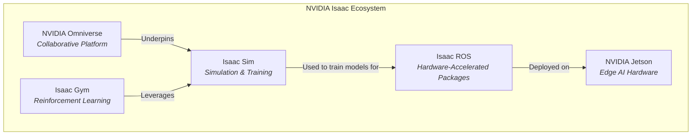

import Tabs from '@theme/Tabs';
import TabItem from '@theme/TabItem';

# Module 3: The AI-Robot Brain - NVIDIA Isaac Platform

Welcome to the intersection of AI and robotics, accelerated by dedicated hardware and a unified software stack. This chapter introduces the **NVIDIA Isaac platform**, an ecosystem designed to fast-track the development, simulation, and deployment of AI-powered robots. Think of it as the specialized "brain" and "nervous system" for robots that need to perform complex perception and decision-making tasks.

## 1. Learning Objectives

-   **Explain** what the NVIDIA Isaac platform is and its role in the AI robotics ecosystem.
-   **Describe** the key components: Isaac Sim, Isaac ROS, and Isaac Gym.
-   **Understand** the benefits of using a unified, hardware-accelerated platform.
-   **Set up** a basic Isaac Sim environment and run a pre-built demo.
-   **Understand** how Isaac ROS packages accelerate high-performance robotics applications.
-   **Explain** the concept of "hardware-in-the-loop" (HIL) simulation.

---

## 2. Introduction to the NVIDIA Isaac Platform

NVIDIA Isaac is not a single product, but a comprehensive **end-to-end platform** for robotics. It provides tools that span the entire development lifecycle, from training AI models and simulating robot behavior to deploying and managing fleets of robots in the real world.

NVIDIA's vision for robotics is a vertically integrated stack where hardware and software are co-designed for maximum performance. This is especially critical for AI-based robotics, where the massive computational demands of perception and navigation algorithms can be a significant bottleneck.


*Figure 1: The major components of the NVIDIA Isaac ecosystem, from cloud simulation to edge deployment.*

---

## 3. Core Components of NVIDIA Isaac

### a. Isaac Sim

**Isaac Sim** is a photorealistic, physically-accurate robotics simulator built on the **NVIDIA Omniverse** platform. It is designed to be the ultimate virtual environment for developing, testing, and training AI-based robots before deploying them to the real world.

**Key Features:**
-   **Photorealism (RTX Rendering)**: Isaac Sim leverages NVIDIA's RTX technology to produce stunningly realistic visuals, which is crucial for training computer vision models that can generalize to the real world.
-   **Physically Accurate (PhysX 5)**: It uses a state-of-the-art physics engine to accurately simulate the dynamics of robots and their interaction with the environment.
-   **Domain Randomization**: To improve the robustness of AI models, Isaac Sim can automatically vary simulation parameters like lighting, textures, and object positions during training. This forces the model to learn the essential features of a task rather than memorizing the virtual environment.

### b. Isaac ROS

**Isaac ROS** is a collection of hardware-accelerated software packages for ROS 2. These packages are specifically optimized to run on **NVIDIA Jetson** embedded platforms and NVIDIA GPUs, providing a massive performance boost for common robotics algorithms.

Instead of running a SLAM or object detection algorithm on the CPU, Isaac ROS offloads these tasks to the dedicated processing cores of the GPU, freeing up the CPU for other tasks.

```mermaid
graph TD
    subgraph Standard ROS 2 Application
        A[Camera Node] -- Image Data --> B[Perception Node (CPU)];
        B -- Perception Output --> C[Navigation Node];
    end

    subgraph Isaac ROS Application
        D[Camera Node] -- Image Data --> E[Isaac ROS Node (GPU Accelerated)];
        E -- Perception Output --> F[Navigation Node];
    end

    style B fill:#f9f,stroke:#333,stroke-width:2px
    style E fill:#9f9,stroke:#333,stroke-width:2px
```
*Figure 2: Isaac ROS offloads computationally expensive tasks from the CPU to the GPU, leading to significant performance gains.*

### c. Isaac Gym

**Isaac Gym** is a high-performance reinforcement learning (RL) framework. While other RL frameworks might run a handful of simulations in parallel on the CPU, Isaac Gym leverages the massive parallelism of the GPU to run **thousands** of simulations simultaneously. This dramatically reduces the time required to train a robot to perform complex tasks, like dexterous manipulation or bipedal locomotion.

---

## 4. Getting Started with Isaac Sim

Isaac Sim is a powerful tool with specific hardware requirements (an NVIDIA RTX GPU is essential).

**Installation:**
1.  Install the **NVIDIA Omniverse Launcher**.
2.  From the Launcher, install **Isaac Sim**.

**Hands-On: Running a Demo**
1.  Open Isaac Sim from the Omniverse Launcher.
2.  Once loaded, go to the top menu and select `Isaac Examples -> Carter -> Carter Navigation`.
3.  Press the "Play" button at the top of the interface.
4.  You will see a simulated Carter robot in a warehouse environment.
5.  Right-click on the floor of the warehouse to set a navigation goal, and the robot will autonomously navigate to it using its simulated sensors and ROS 2 navigation stack.

This demo showcases the power of Isaac Sim: a photorealistic environment, a physically accurate robot model, and seamless integration with ROS 2, all running out of the box.

---

## 5. High-Performance Perception with Isaac ROS

Isaac ROS provides drop-in replacements for standard ROS 2 packages that are significantly faster.

**Example Use Case: Object Detection**
A standard ROS 2 object detection pipeline might struggle to achieve real-time performance on a resource-constrained device like a Raspberry Pi.

By using an NVIDIA Jetson and the Isaac ROS package for object detection, you can run state-of-the-art models like YOLO or Faster R-CNN in real-time on high-resolution camera streams. This is made possible by leveraging the GPU's Tensor Cores for neural network inference.

---

## 6. Hardware-in-the-Loop (HIL) Simulation

HIL is a technique that combines real hardware with a virtual simulation. In a robotics context, this typically involves running the robot's high-level software (perception, navigation) in a simulator, but connecting it to the real, physical motor controllers and microcontrollers.

Isaac Sim can be used in a HIL setup where:
-   The simulated robot's state is sent to the real motor controller.
-   The real motor controller's output (e.g., measured wheel velocity) is sent back into the simulation.

This allows you to test your low-level hardware and firmware with a high-fidelity, physically accurate simulation of the robot and its environment.

---

## 7. Summary & Key Takeaways

-   The **NVIDIA Isaac platform** is an end-to-end ecosystem for accelerating AI robotics development.
-   **Isaac Sim** provides photorealistic, physically accurate simulation for training and testing.
-   **Isaac ROS** offers GPU-accelerated packages that provide a massive performance boost to common ROS 2 algorithms.
-   **Isaac Gym** enables massively parallel reinforcement learning for training complex behaviors.
-   The platform is built around the idea of **hardware/software co-design**, leveraging NVIDIA GPUs and Jetson devices.

## 8. Chapter Quiz

1.  What is the primary purpose of Domain Randomization in Isaac Sim?
    a) To make the simulation look prettier.
    b) To improve the transfer of AI models from simulation to the real world.
    c) To slow down the simulation for easier debugging.
    d) To test the physics engine.

2.  Isaac ROS packages are primarily designed to run on what type of hardware?
    a) Raspberry Pi
    -   NVIDIA GPUs and Jetson devices
    c) Intel CPUs
    d) Google TPUs

3.  What is the main advantage of Isaac Gym for reinforcement learning?
    a) It is easier to use than other frameworks.
    b) It can run thousands of simulations in parallel on a GPU.
    c) It only works with real robots.
    d) It is written in Python.

4.  NVIDIA Omniverse is:
    a) A robotics hardware platform.
    b) A reinforcement learning algorithm.
    c) A real-time 3D collaboration platform that underpins Isaac Sim.
    d) A ROS 2 package for navigation.

5.  What does HIL (Hardware-in-the-Loop) simulation allow you to test?
    a) Only high-level navigation logic.
    b) Only the robot's camera sensors.
    c) The robot's physical low-level controllers interacting with a simulated world.
    d) The robot's battery life.

*(Answers: 1-b, 2-b, 3-b, 4-c, 5-c)*

## 9. Further Study

-   [NVIDIA Isaac Platform](https://developer.nvidia.com/isaac-robotics-platform)
-   [Isaac Sim Documentation](https://docs.omniverse.nvidia.com/isaacsim/latest/)
-   [Isaac ROS Documentation](https://github.com/NVIDIA-ISAAC-ROS)
