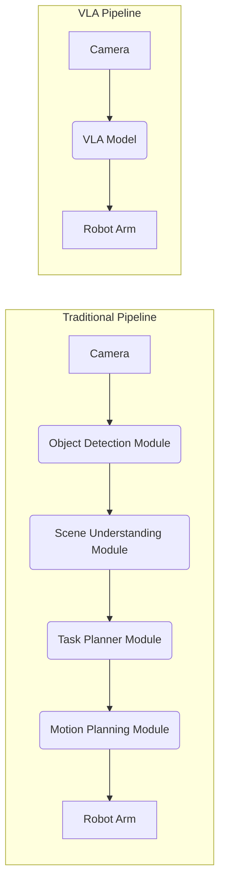

# Module 4: Vision-Language-Action (VLA) Systems - The Next Frontier of Robotics

This chapter explores the cutting edge of AI-powered robotics: **Vision-Language-Action (VLA) models**. These systems represent a paradigm shift from specialized, pre-programmed robots to general-purpose assistants that can understand high-level human instructions and interact with the world in a more intuitive and flexible way.

## 1. Learning Objectives

-   **Define** what a Vision-Language-Action (VLA) model is.
-   **Explain** the significance of VLAs in creating more general-purpose robots.
-   **Describe** the high-level architecture of a VLA.
-   **Understand** the role of Large Language Models (LLMs) and Vision Transformers (ViTs) in modern VLAs.
-   **Explain** the concept of "Embodied AI" and how VLAs are a key step towards it.
-   **Discuss** the major challenges and future directions in VLA research.

---

## 2. From Specialized Robots to General-Purpose Assistants

For decades, the most successful robots have been highly specialized. A factory robot arm is incredibly good at welding a car door, but it cannot make a cup of coffee. A vacuum cleaning robot excels at navigating floors, but it cannot pick up a toy from the floor.

This specialization is a major limitation. The dream of robotics has always been to create **general-purpose** assistants that can perform a wide variety of tasks in unstructured human environments. To do this, a robot needs to:

1.  **See** the world and understand the objects, people, and relationships within it.
2.  **Understand** high-level, ambiguous human language (e.g., "Can you clean up this mess?").
3.  **Formulate a plan** of action to achieve the goal.
4.  **Execute** that plan by controlling its motors and actuators.

This is the challenge that Vision-Language-Action models are designed to solve.

---

## 3. What are Vision-Language-Action (VLA) Models?

A VLA is a single, end-to-end neural network that takes raw sensor inputs (vision) and a natural language command (language) and outputs a sequence of actions for the robot to execute (action).

It's a model that learns the direct mapping from "seeing and hearing" to "doing."

```mermaid
graph TD
    A[Vision Input<br/>(Camera Feed)]
    B[Language Input<br/>("Pick up the red apple")]
    
    subgraph VLA Model
        C(Vision Encoder)
        D(Language Encoder)
        E(Fusion Layer)
        F(Action Decoder)
    end

    G[Action Output<br/>(Motor Commands)]

    A --> C
    B --> D
    C --> E
    D --> E
    E --> F
    F --> G
```
*Figure 1: The high-level pipeline of a Vision-Language-Action model.*

This is a stark contrast to traditional robotics pipelines, which are often composed of many separate, hand-coded modules.


*Figure 2: A traditional robotics pipeline vs. an end-to-end VLA pipeline.*

---

## 4. Architectural Deep Dive

VLAs are built on the same transformer architecture that powers models like GPT-4 and DALL-E 2.

### a. Vision Encoder

The vision component is typically a **Vision Transformer (ViT)**. A ViT works by:
1.  Breaking an image down into a grid of smaller patches.
2.  Treating each patch as a "word" or "token."
3.  Passing this sequence of image patches through a transformer network to learn the relationships between different parts of the image.
The output is a set of embeddings—a numerical representation of the visual scene.

### b. Language Encoder

The language command is processed by a standard **Large Language Model (LLM)**, like a smaller version of GPT or LLaMA. The LLM converts the text command into its own set of embeddings.

### c. The "Fusion" Layer

This is where the magic happens. The vision embeddings and the language embeddings are "fused" together, usually by simply concatenating them and passing them through another set of transformer layers. This allows the model to learn the cross-modal connections between what it sees and the command it has been given. For example, it learns to associate the word "apple" in the command with the pixels that represent an apple in the image.

### d. The Action Decoder

The final component is an **action decoder**. It takes the fused vision-language representation and outputs a sequence of actions. These actions could be low-level motor torques or, more commonly, high-level commands like "move end-effector to position (x, y, z)."

---

## 5. VLAs and Embodied AI

**Embodied AI** is a field of artificial intelligence focused on creating intelligent agents that are "embodied" in a physical or virtual body and can interact with their environment.

VLAs are a cornerstone of this field because they directly address the "embodiment problem": how does an intelligent agent connect its perception and reasoning to physical action? By learning an end-to-end mapping from pixels and text to actions, VLAs are a powerful approach to creating truly embodied agents.

### State-of-the-Art Examples

-   **PaLM-E (Pathways Language Model - Embodied)**: A model from Google that can accept multi-modal inputs (images, text) and output text responses *or* robotic actions. It demonstrated the ability to transfer knowledge from general web data to robotics tasks.
-   **RT-2 (Robotics Transformer 2)**: Another model from Google that showed how a VLA can be trained on web-scale data to learn general concepts about the world, and then apply that knowledge to robotics tasks it has never seen before, demonstrating impressive generalization.

---

## 6. Challenges and the Road Ahead

VLAs are incredibly promising, but they are not a solved problem. The major challenges include:

-   **Data Scarcity**: Training these massive models requires huge amounts of data showing robots performing tasks. This data is far more difficult and expensive to collect than the text and image data used to train LLMs and vision models.
-   **Sim-to-Real Transfer**: While we can generate lots of data in simulation, models trained in simulation often fail in the real world due to subtle differences in physics, lighting, and appearance (the "reality gap").
-   **Safety and Reliability**: As these models become more general-purpose, ensuring they are safe and reliable becomes exponentially harder. How do you guarantee a robot won't misunderstand a command in a dangerous way?
-   **Real-time Performance**: VLAs are computationally expensive. Running them in real-time on the limited compute hardware available on a mobile robot is a major engineering challenge.

---

## 7. Summary & Key Takeaways

-   **VLAs** are end-to-end models that map vision and language directly to robotic actions.
-   They represent a shift from specialized robots to **general-purpose assistants**.
-   They are built on the **transformer architecture**, leveraging Vision Transformers (ViTs) and Large Language Models (LLMs).
-   VLAs are a key technology for achieving **Embodied AI**.
-   Major challenges remain in **data collection, sim-to-real transfer, and safety**.

## 8. Chapter Quiz

1.  What does VLA stand for?
    a) Vision-Language-Actuator
    b) Vision-Language-Action
    c) Visual-Linguistic-Actuator
    d) Vision-Linguistic-Action

2.  What is the main advantage of a VLA over a traditional robotics pipeline?
    a) It is composed of many specialized modules.
    b) It is an end-to-end model that can learn directly from data.
    c) It is easier to program by hand.
    d) It does not require a camera.

3.  What is a Vision Transformer (ViT) used for in a VLA?
    a) To process the language command.
    b) To decode the final motor commands.
    c) To process raw image data into a meaningful representation.
    d) To fuse the vision and language data.

4.  The "reality gap" is a major challenge in which area of VLA research?
    a) Language understanding
    b) Sim-to-real transfer
    c) Action decoding
    d) Hardware design

5.  Embodied AI refers to intelligent agents that:
    a) Exist only in a simulated environment.
    b) Can pass the Turing test.
    c) Are situated in a body and can interact with an environment.
    d) Are based on the transformer architecture.

*(Answers: 1-b, 2-b, 3-c, 4-b, 5-c)*

## 9. Further Study

-   [Google AI Blog: RT-2: New model translates vision and language into action](https://www.deepmind.com/blog/rt-2-new-model-translates-vision-and-language-into-action)
-   [Google AI Blog: PaLM-E: An embodied multimodal language model](https://ai.googleblog.com/2023/03/palm-e-embodied-multimodal-language.html)
