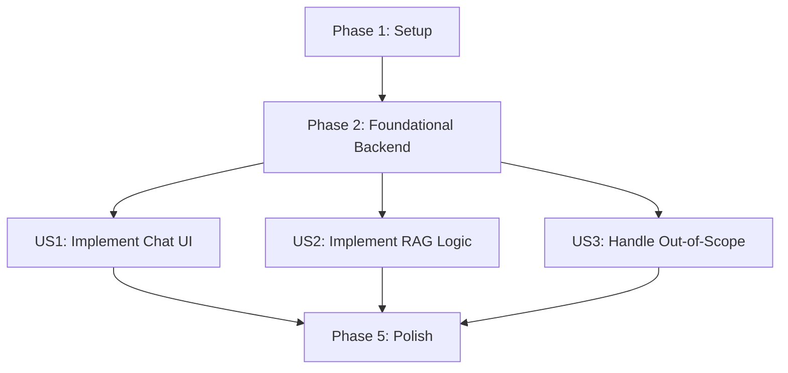

# Tasks for Integrated RAG Chatbot

This document outlines the tasks required to implement the integrated RAG chatbot.

## Dependencies

The user stories have the following dependencies:
- **US1** is a prerequisite for all other stories.
- **US2** and **US3** can be worked on in parallel after US1 is complete, but both depend on the backend being functional.

## Parallel Execution

- Within Phase 2, database setup and backend service structure can be done in parallel.
- Within US1, the frontend component can be built while the backend endpoint is being stubbed.
- US2 and US3 tasks are highly related and will likely be implemented together in the RAG pipeline logic.

---

## Phase 1: Setup

- [ ] T001 Create a new directory `rag-chatbot-backend` for the FastAPI application.
- [ ] T002 Create a `pyproject.toml` file in `rag-chatbot-backend` with dependencies: `fastapi`, `uvicorn`, `pydantic`, `qdrant-client`, `google-generativeai`, `psycopg2-binary`, `tenacity`.
- [ ] T003 Create a basic FastAPI app structure in `rag-chatbot-backend/app/main.py`.
- [ ] T004 Create a `.env` file in `rag-chatbot-backend` to manage API keys and database URLs.

---

## Phase 2: Foundational Backend

- [ ] T005 [P] Implement database models in `rag-chatbot-backend/app/models.py` for `ChatSession` and `ChatMessage` based on `data-model.md`.
- [ ] T006 [P] Implement a database connection manager in `rag-chatbot-backend/app/db.py` for Neon Postgres.
- [ ] T007 Implement a Qdrant client manager in `rag-chatbot-backend/app/vector_store.py`.
- [ ] T008 Implement a Gemini API client in `rag-chatbot-backend/app/llm.py`.
- [ ] T009 Create an ingestion script `rag-chatbot-backend/ingest.py` to read markdown, chunk text, and upload to Qdrant.
- [ ] T010 Define the `/chat` endpoint request and response schemas in `rag-chatbot-backend/app/schemas.py`.

---

## Phase 3: User Stories

### User Story 1: Access the Chatbot

- **Goal**: User can see and open the chat interface.
- **Test**: A floating button is on all pages; clicking it opens the chat UI.

- [ ] T011 [US1] Create a new React component `FloatingChatButton` in `my-robotics-textbook-project/src/theme/FloatingChatButton.tsx`.
- [ ] T012 [US1] Style the `FloatingChatButton` using CSS modules in `my-robotics-textbook-project/src/theme/FloatingChatButton.css`.
- [ ] T013 [US1] Swizzle the Docusaurus `Layout` component to include the `FloatingChatButton` on all pages. `my-robotics-textbook-project/src/theme/Layout.tsx`.
- [ ] T014 [US1] Implement the chat modal/panel UI, including an input field and a message display area inside the `FloatingChatButton` component.
- [ ] T015 [US1] Implement the client-side logic to call the `/chat` API endpoint in `my-robotics-textbook-project/src/theme/FloatingChatButton.tsx`.

### User Story 2 & 3: Get Answers & Handle Out-of-Scope Questions

- **Goal**: User gets accurate, grounded answers, or an "I don't know" response.
- **Test**: Ask in-scope and out-of-scope questions and validate the responses.

- [ ] T016 [US2] Implement the `/chat` endpoint logic in `rag-chatbot-backend/app/main.py`.
- [ ] T017 [US2] In the `/chat` endpoint, implement the retrieval step to get context from Qdrant based on the user's message.
- [ ] T018 [US2] In the `/chat` endpoint, implement the generation step using the Gemini API and the retrieved context.
- [ ] T019 [US3] In the `/chat` endpoint, implement the logic to check if context was found. If not, return an "I don't know" response.
- [ ] T020 [US2] In the `/chat` endpoint, save the user message and the assistant's response to the Postgres database.
- [ ] T021 [US2] Implement session management to handle conversation history. Pass previous messages to the LLM for follow-up questions.

---

## Phase 4: Deployment & Polish

- [ ] T022 Create a `Dockerfile` for the FastAPI backend.
- [ ] T023 Configure a new web service on Render to build and deploy the `rag-chatbot-backend` from the `Dockerfile`.
- [ ] T024 Set up environment variables for the production service on Render.
- [ ] T025 Configure CORS on the FastAPI backend to allow requests from the Docusaurus production URL.
- [ ] T026 Add error handling to the frontend chat UI for API failures.
- [ ] T027 Add loading indicators to the frontend chat UI while waiting for the API response.
- [ ] T028 Ensure the send button is disabled if the chat input is empty.

## Implementation Strategy

The implementation will follow an MVP-first approach.
1.  **Backend First**: Build and deploy the core backend RAG service (Phases 1 & 2).
2.  **Frontend Integration**: Build the floating chat button and connect it to the deployed backend (US1).
3.  **Core Logic**: Implement the RAG pipeline and conversation history (US2 & US3).
4.  **Deployment**: Deploy the backend and integrate with the production Docusaurus site.
